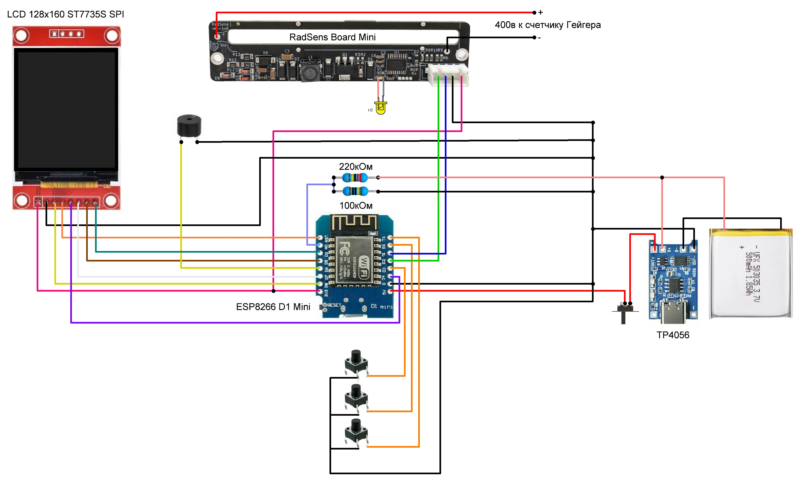

Радиометр на базе платы RadSens от ClimateGuard
 
https://climateguard.ru/radsens/
 

 
Изменяемые параметры платы RadSens: 
 
Настройка чувствительности счетчика:
radSens.setSensitivity(105); //установить  
radSens.getSensitivity(); //считать состояние 
значение 105 - по умолчанию для счетчика СБМ-20. 
 
Включение-выключение высоковольтного генератора: 
radSens.setHVGeneratorState(bool state); //установить  
radSens.getHVGeneratorState(); //считать состояние 
 
Включение-выключение светодиодного индикатора: 
radSens.setLedState(bool state); //установить  
radSens.getLedState(); //считать состояние 
 
Получение данных: 
radSens.getNumberOfPulses(); //количество зарегистрированных импульсов 
radSens.getRadIntensyDynamic(); //динамическое значение мощности дозы в мкР/ч 
radSens.getRadIntensyStatic(); //статическое значение мощности дозы в мкР/ч 
 
В проекте используется: 
 
EPS8266 D1 mini
 

 
LSD дисплей 128x160 ST7735S с шиной SPI
 
Модуль заряда аккумуляторов TP4056
 
Резисторы: 220кОм, 100кОм
 
Литьевый аккумулятор
 
Кнопка -3шт
 
Выключатель
 
Пищалка 
 

  
В проекте используются следующие библиотеки: 
 
Adafruit-ST7735-Library 
https://github.com/adafruit/Adafruit-ST7735-Library 
 
Official RadSens library by ClimateGuard 
https://github.com/climateguard/RadSens 
 
Blynk от Volodymyr Shymanskyy Внимание!!! есть ограничение на версию - не старше 1.1.0 
Blynk сервер - blynk.tk 
Руководство по подключению https://wiki.blynk.tk/ 
 
Дополнительные ссылки для менеджера плат: https://arduino.esp8266.com/stable/package_esp8266com_index.json 
 
Работа кнопки:
 
короткое нажатие - вкл., откл. световых сигналов 
долгое нажатие (1сек.) - вкл., откл. звукового сигнала 
 
На экране отображаются следующие данные:
 
-Текущая скорость счета; 
-Динамичеое значение мощности дозы в мкР или мР 
Содержит динамическое значение интенсивности ионизирующего гамма-
излучения. При детектировании резкого изменения интенсивности излучения
(как в большую, так и в меньшую сторону) динамически регулирует период счета
скользящего окна, чтобы диапазон охватывал временной промежуток,
содержащий только актуальные данные. Позволяет использовать устройство в
режиме поиска локальных загрязнений. Частота обновления – 1 сек.
 
-Статическое значение мощности дозы в мкР или мР
Содержит статистическое значение интенсивности ионизирующего гамма-
излучения. Период счета скользящего окна составляет 500 сек. Позволяет
производить точные измерения постоянного радиационного фона. Частота
обновления – 1 сек. 
 
пример отображения данных в мобильном приложении Blynk
 

  
Управление через API:
 
Пример: https://api.blynk.tk/{TOKEN}/update/V0?value=0
 
 
Радиометр на счетчике СБТ10-А 

